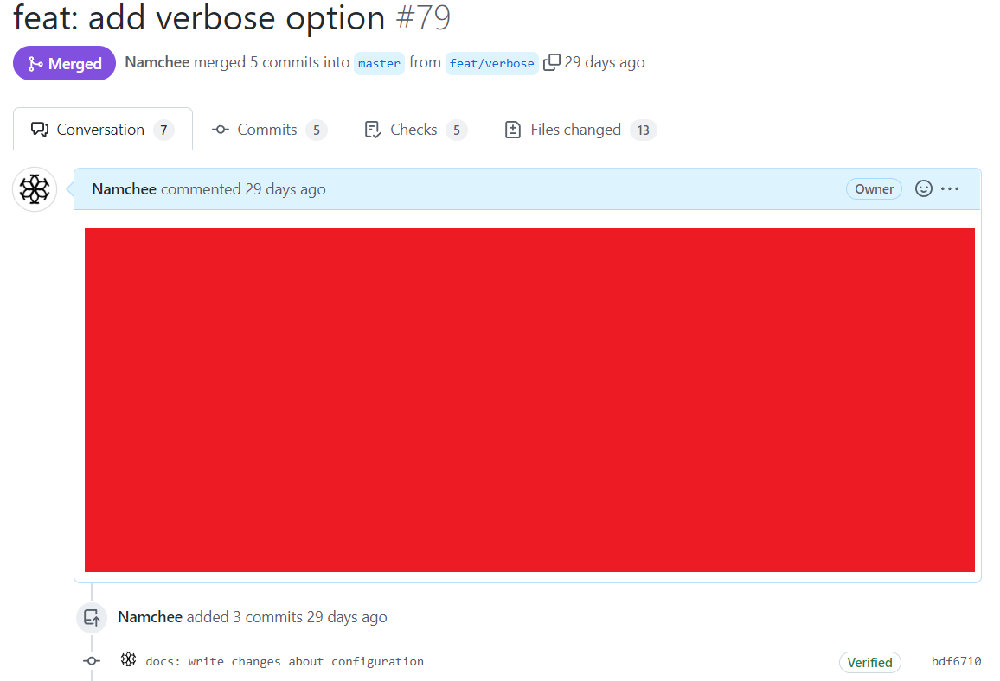

# Administrator Whitelist

Default | Type | Configuration
------- | ---- | -------------
**INACTIVE** | `boolean` | `strict`

The administrators whitelist is a whitelist that allows any pull requests that have been submitted by a user with administrator privileges in the repository to be marked as a valid pull request.

## Example

`conventional-pr` is executed with the following inputs.

```yml
on:
  pull_request:

jobs:
  cpr:
    runs-on: ubuntu-latest
    steps:
      - name: Validates the pull request
        uses: Namchee/conventional-pr@master
        with:
          access_token: access_token
          strict: false
```

User `Namchee` is a user with adminstrator privileges that has submitted the following pull request.



Since `strict` option is disabled, the pull request will automatically be marked as a valid pull request even if the pull request does not meet all criteria that has been set by validators.