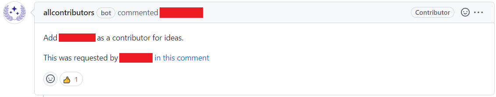

# Bot Whitelist

Default | Type | Configuration
------- | ---- | -------------
**ACTIVE** | `boolean` | `bot`

The bot whitelist is a whitelist that allows any pull requests that have been submitted by a bot account to be marked as a valid pull request.

Do note that this whitelist only works on GitHub-recognized bot accounts. For usage with user-bot account, please use the [user whitelist](./user.md).

## Example

Below is the example of a pull request made by a bot.

