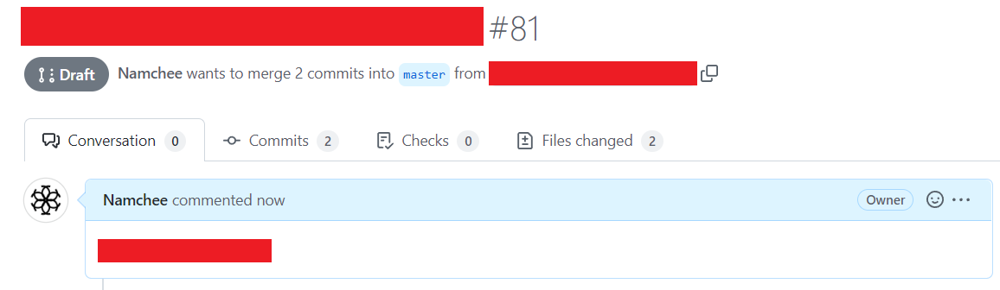

# Draft Whitelist

Default | Type | Configuration
------- | ---- | -------------
**ACTIVE** | `boolean` | `draft`

The draft whitelist is a whitelist that allows any draft pull requests to be marked as a valid pull request. 

Do note that once the pull request has been marked as ready for review, the workflow will be re-triggered.

For more information about draft pull requests, [please refer to the official GitHub documentation](https://docs.github.com/en/pull-requests/collaborating-with-pull-requests/proposing-changes-to-your-work-with-pull-requests/about-pull-requests#draft-pull-requests).

## Example

Below is the example of a draft pull request

